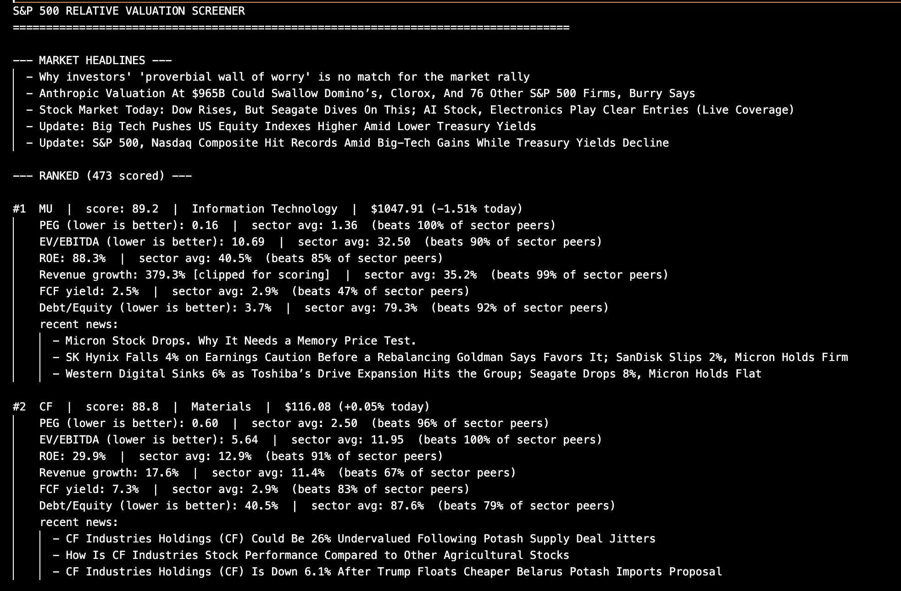
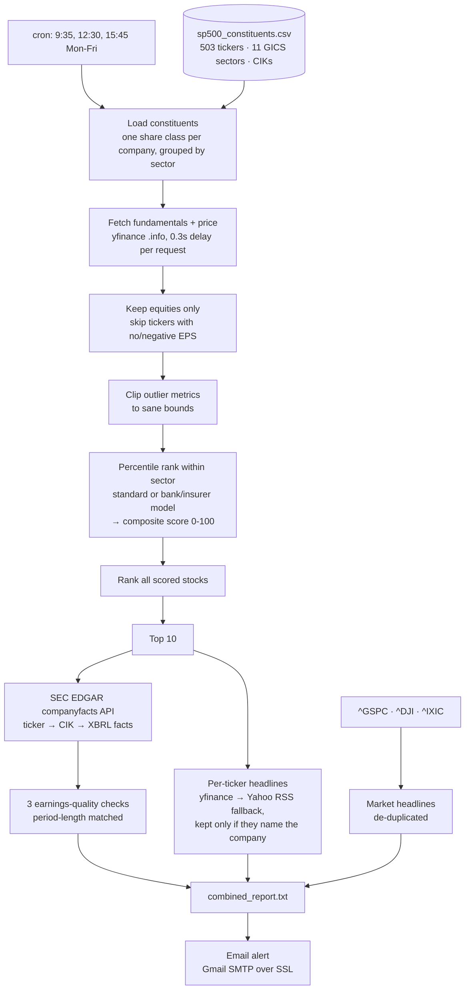

# S&P 500 Stock Research System

An automated equity-research pipeline that ranks the 500 companies in the S&P 500 on relative value against their GICS sector peers. It then checks the top 10 for earnings-quality red flags in their SEC filings and emails a summary three times every trading day.



## How it works



## Features

- **Full-index screening:** scores every company in the S&P 500 against its real GICS sector peers rather than a hand-picked peer list. The index has 503 tickers, but companies with two share classes (GOOGL/GOOG, FOXA/FOX, NWSA/NWS) are counted once, matched by SEC CIK, which leaves 500 companies. A recent full run scored 472 of them. The other 28 were skipped: 27 because their trailing EPS was negative or missing, and Berkshire Hathaway because its GAAP earnings swing with its investment portfolio.
- **Six weighted valuation metrics:**
  - PEG (25%)
  - EV/EBITDA (25%)
  - ROE (15%)
  - Revenue growth (15%)
  - FCF yield (10%)
  - Debt/equity (10%)

  Each metric is scored as the stock's percentile rank among its sector peers, and the weighted ranks combine into one composite score from 0 to 100.
- **Separate model for banks and insurers:** 42 banks, insurers, brokers and lenders are scored on P/B (30%), ROE (35%), PEG (15%) and revenue growth (20%) instead, ranked only against each other. They're picked by GICS sub-industry, and the report tags them `[bank/insurer model]`.
- **SEC filing red-flag checks** on the top 10, using XBRL data from EDGAR's `companyfacts` API rather than PDF scraping:
  - Receivables growing 15+ percentage points faster than revenue
  - Operating cash flow below 0.7× net income
  - A gross-margin swing of 5+ percentage points period over period
- **News context:** up to three headlines for each top-10 stock, kept only if they mention its ticker or company name, plus up to five de-duplicated market headlines drawn from the S&P 500, Dow, and Nasdaq index feeds.
- **Email alert after every run:** lists the top 10 tickers with their scores and names which red-flag checks fired for which stocks. The full report is saved to `combined_report.txt`.
- **Growth variant:** `growth_screener.py` applies a hard ≥10% revenue-growth filter before ranking. It reuses the same scoring code.

## Challenges I solved

- **Outlier fundamentals from yfinance.** yfinance sometimes returns extreme values, such as ROE in the thousands of percent or debt/equity above 50,000%. These come from negative equity or one-off accounting events. When stocks were scored against their sector average, one bad data point could distort the score of every peer in that sector. I added per-metric bounds (`METRIC_CLIP`) that cap each value before it enters any average or score. The sector averages shown in the report use the clipped values, while each stock's raw value still appears, marked `[clipped for scoring]`.
- **Mixed reporting periods in SEC EDGAR data.** The same XBRL tag holds both quarterly (10-Q, ~90 days) and annual (10-K, ~365 days) values. Comparing the two most recent entries by end date could pair a quarter against a full year. One result was NVDA showing −62% revenue "growth." I now filter income-statement and cash-flow facts down to entries whose duration is within 20 days of the latest entry's, so only like-for-like periods are compared.
- **Inconsistent SEC tags and yfinance fields.** Companies report the same concept under different XBRL tags. Revenue alone has three common tags (`Revenues`, `RevenueFromContractWithCustomerExcludingAssessedTax`, `SalesRevenueNet`), so each check tries a list of tags in order. When `GrossProfit` isn't reported, gross profit is derived from revenue minus COGS. On the yfinance side, the code falls back between `trailingPegRatio`/`pegRatio` and `currentPrice`/`regularMarketPrice`, handles two different news formats, falls back to Yahoo's RSS headline feed after yfinance's news endpoint started returning 404s, and waits 0.3s between requests to stay under Yahoo's rate limits during a 500-ticker scan.
- **Sector-relative scores that blew up.** I originally scored each metric as a percentage difference from its sector average. When a sector's average was near zero, as FCF yield often is, one stock showed "+6,505.9% vs sector" on FCF yield and a composite score of 643.8, swamping every other metric. I switched to percentile rank within each sector: the share of sector peers a stock beats on each metric, with ties counted as half. Every metric score is now bounded between 0 and 100, so one outlier can't dominate the ranking. I chose rank over a z-score because a z-score divides by the sector's standard deviation, which has the same problem when values are tightly bunched.
- **Duplicate share classes.** GOOG and GOOGL are the same company, but the two classes trade at slightly different prices, so yfinance gave them slightly different valuation ratios. In small peer groups they ended up ranked against each other: in one test run, GOOG scored 80 and GOOGL scored 20. Share classes have the same SEC CIK, so I now keep one ticker per CIK. The 503 index listings resolve to 500 companies automatically, with no hardcoded list to maintain.
- **Valuation metrics that don't fit banks and insurers.** EV/EBITDA, FCF yield and debt/equity treat debt and cash flows as signs of leverage or spare cash, but for banks and insurers they're the business itself: deposits, insurance float, client balances. yfinance often had no EV/EBITDA or FCF for banks at all, so they were effectively ranked on the few metrics left, against payment networks and exchanges. I gave the 42 banks, insurers, brokers and lenders their own model, chosen by GICS sub-industry plus the three custody banks GICS files with asset managers. It scores P/B, ROE, PEG and revenue growth, and ranks each metric only against peers on the same model, because payment networks' ROE runs 5–20× a bank's. Scores stay on the 0–100 scale under both models. Banks with low P/B rose (USB went from #437 to #302), while HIG fell from #3 to #51, because its rank had leaned on a one-off 0.12 PEG. To check that the change didn't touch anyone else, I scored the standard-model companies with the old code on the same data and got identical results. Berkshire Hathaway is excluded and listed with its reason: since 2018, GAAP has counted its unrealized investment gains as earnings, which distorts its ROE, PEG and even yfinance's revenue figure, and yfinance's P/B for it is off by about 1,500×.

## Tech stack

- **Python 3:** `requests`, `yfinance`, and the standard library (`csv`, `smtplib`, `email`)
- **Data sources:** Yahoo Finance via `yfinance` for prices and ratios, Yahoo's RSS feed for headlines, and the SEC EDGAR XBRL API for filed financial statements
- **Scheduling:** `cron`, plus `caffeinate` to keep the Mac awake during market hours
- **Alerts:** Gmail SMTP over SSL, with credentials read from environment variables

## Run it

### Setup

```bash
git clone https://github.com/Hmelconian21/Stock-Research-System.git
cd Stock-Research-System
pip install -r requirements.txt

cp .env.example .env   # then fill in your values
```

`.env` holds the credentials. It's gitignored.

| Variable | Required? | Purpose |
|---|---|---|
| `SEC_USER_AGENT_EMAIL` | Yes, for SEC checks | SEC's fair-access policy requires a contact email in the request header |
| `GMAIL_ADDRESS` | For email alerts | The Gmail account that sends the alert |
| `GMAIL_APP_PASSWORD` | For email alerts | A 16-character [Gmail App Password](https://support.google.com/accounts/answer/185833), not your normal password |
| `NOTIFY_EMAIL` | Optional | Where alerts go. Defaults to `GMAIL_ADDRESS` |

The scripts read these with `os.environ`, so load `.env` into your shell first:

```bash
set -a; . ./.env; set +a

cd combined_report
python3 combined_report.py --test   # quick smoke run: 2 tickers per sector
python3 combined_report.py          # full S&P 500 scan, ~10-20 minutes
```

If the Gmail variables aren't set, the run still completes. It just skips the email. Each module also runs on its own:

```bash
python3 screener/screener.py                       # full ranked list → screener_results.txt
python3 statement_analyzer/statement_analyzer.py NVDA   # red-flag checks for one ticker
python3 combined_report/growth_screener.py --test  # growth-filtered ranking
```

### Scheduling with cron

The pipeline runs three times each weekday: shortly after the open, at midday, and before the close. Edit your crontab with `crontab -e`:

```cron
PATH=/usr/local/bin:/usr/bin:/bin:/usr/sbin:/sbin

# Keep the Mac awake from 9:25 for 6.5 hours, covering the trading day
25 9 * * 1-5 /usr/bin/caffeinate -u -t 23400

# Run the pipeline at 9:35, 12:30 and 15:45
35 9  * * 1-5 cd /path/to/stock-research-system && set -a && . ./.env && set +a && cd combined_report && python3 combined_report.py >> run_log.txt 2>&1
30 12 * * 1-5 cd /path/to/stock-research-system && set -a && . ./.env && set +a && cd combined_report && python3 combined_report.py >> run_log.txt 2>&1
45 15 * * 1-5 cd /path/to/stock-research-system && set -a && . ./.env && set +a && cd combined_report && python3 combined_report.py >> run_log.txt 2>&1
```

Cron doesn't load your shell profile, which is why each line sources `.env` itself. Times use the machine's local time zone. Output from each run is appended to `combined_report/run_log.txt`, which is gitignored.

## Sample output

Full sample outputs are in `combined_report/combined_report.txt`, `screener/screener_results.txt`, and `statement_analyzer/statement_analysis_*.txt`.

*Personal research tool. Not investment advice.*
